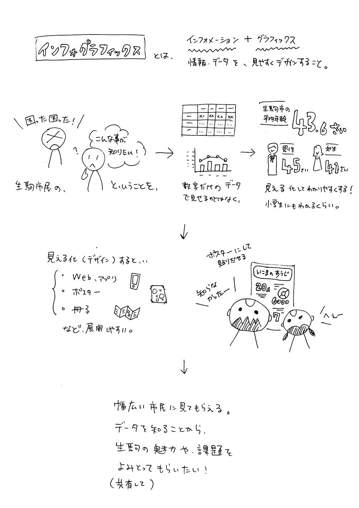

# Inforgraphics for Ikoma
## 趣旨
2016年3月5日のOpenDataDayで、「地域課題をどうやって拾ったらいいのか？」という点も議題にあがりました。このインフォグラフィックスが直接課題を解決するわけではないですが、まずはデータを知ることで、生駒の課題や魅力を認識したり共有したりするツールがあっていいんじゃないかと思いました。

デザインについては、インフォグラフィックスと言ってもいろいろな表現方法があるので（ぜひ画像検索してみてください）、自分もデザインしてみたい！という方にはどんどん参加して欲しいです。色々な作風があったほうが見ていて楽しいですしね。学生さんにも参加してほしいです！

デザインの前の、どんなデータを見える化するかについては、出来るだけ色々な視点からの「データの切り口」があれば、より深みのあるコンテンツになるのではと思っています。そして、その工程で、デザインは出来ないけれども、参加したい意思のある皆さんのお力を借りたいです。

今あるデータは、CODE for IKOMAのデータポータルサイトで見られます。
http://data.code4ikoma.org/
今ないデータの取り方についても議論の余地がありそうですね。

データの見せ方について、メディアのように偏りのある見せ方には注意を払う必要があるなーと思ってます。あくまで、良い悪いは置いておいて、フェアな立場でこういうデータがある、ということを伝えられればと思っています。

作品がたまってきたら、ウェブにまとめて見られる場所を作りたいです。「いこまのすうじ」などわかりやすい名前にして、小学生にも見てもらえるようなコンテンツになれば素敵だなーと。夢はふくらみますが、まずはともあれ手を動かして作ってみますね。参加はどなたでもウェルカムです！

## データ
[2016年3月時点の人口データ（Google Document）](https://docs.google.com/spreadsheets/d/1phkKQR9SgTrm6lq4wmSNHv7jdazWRthJWcPzIZiu1XI/edit#gid=1180363720)